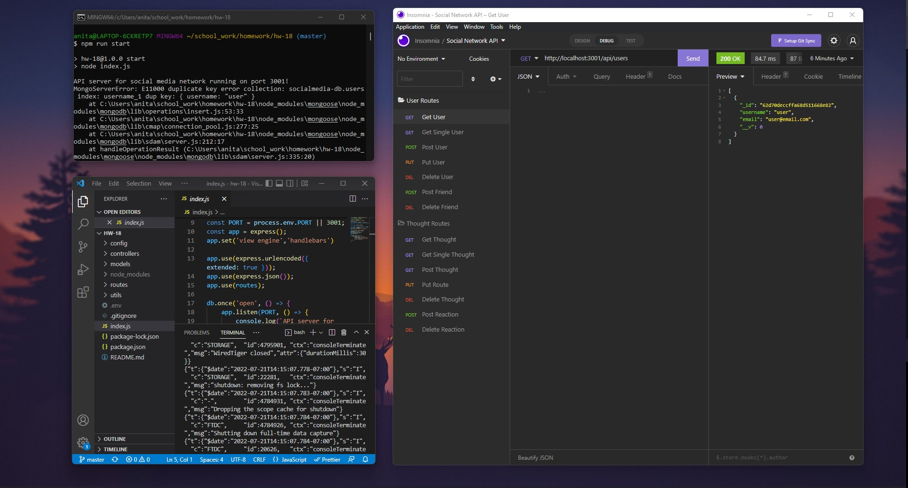

# Social Network API

## Description

This project is an API for social network web applications. This API allows users to share their thoughts, react to friends’ thoughts, and create a friend list.

Purely utilizing back-end programming, [Express.js](https://www.npmjs.com/package/express) is used for routing, [MongoDB](https://www.npmjs.com/package/mongodb) for a NoSQL database, and [Mongoose](https://www.npmjs.com/package/mongoose) packages for Object Data Modeling (ODM) and to create a connection between MongoDB and the Node.js Javascipt.

Seed data has been created for the sake of demonstrating functionality when testing the API in [Insomnia](https://insomnia.rest/products/insomnia).


## Table of Contents

- [User Story](#user-story)
- [Installation and Usage](#installation-and-usage)
- [Technologies Utilized](#technologies-utilized)
- [Walkthrough](#walkthrough)
- [Contributors](#contributors)
- [License](#license)


## User Story

```md
AS A social media startup
I WANT an API for my social network that uses a NoSQL database
SO THAT my website can handle large amounts of unstructured data
```


## Installation and Usage

In order to run the application, ensure that firstly you have Node.js installed and have an account with [MongoDB](https://www.npmjs.com/package/mongodb). Then, while in the root of your file structure, run `npm init -y` in your Command Line Interface (CLI) to initialize your local directory. Then run `npm i` to install all relavent node package dependancies. Lastly, entering `npm run start` to the CLI should run the application. In a seperate terminal (again at your root), run `mongod` concurrently to run the server. The launched API can be viewed by either entering `http://localhost:3001/` in your browser or [Insomnia](https://insomnia.rest/products/insomnia), followed by the relevant API route.

To use this API, you need a front-end.    

First, fork this GitHub repository containing the back-end code. From there, you will need to perform a git clone operation on the forked repository to bring it to your local machine.   

This code should be placed at the root of your Social Network project file structure, while you work on front-end code contained in a `views` and `public` folder at the same level.    

In your front-end code, you will need to make API calls to fetch data stored in the database, and use functions to pass the retrieved information through to the Document Object Model (DOM). Additionally, you will need to be able to pass user-input from the user interface of the Social Network back through into the database.    

You will also need to include a `.env` file with your [MongoDB](https://www.npmjs.com/package/mongodb) database password, as well as a `.gitignore` file excluding the following:
```
node_modules
.DS_store
.env
```   


## Technologies Utilized

> [Javascript](https://www.javascript.com/)

> [Node.js](https://nodejs.org/en/)
> - [Mongoose](https://www.npmjs.com/package/mongoose)
> - [Express.js npm](https://expressjs.com/)
> - [dotenv](https://www.npmjs.com/package/dotenv)

> [MongoDB](https://www.npmjs.com/package/mongodb)

> [Insomnia](https://insomnia.rest/products/insomnia)


## Walkthrough

[]({https://drive.google.com/file/d/1R956JZx-0g-qMl-b1AwuEzexuCGdvN-k/view} "Walkthrough - Application Demo")

## Contributors

Thank you for checking out my project! If you would like to see more of my work, please take a peek at my [GitHub](https://github.com/anitachengalva/) and [portfolio](http://anitachengalva.github.io/portfolio).

[ LinkedIn](https://www.linkedin.com/anitachengalva)
&nbsp;
[ GitHub](https://github.com/anitachengalva)


## License

This project is licensed under the MIT License &nbsp; &nbsp; &nbsp; [](https://choosealicense.com/licenses/mit/)

Please click on the green MIT License Shield above to learn more about what the limitations of this license are.